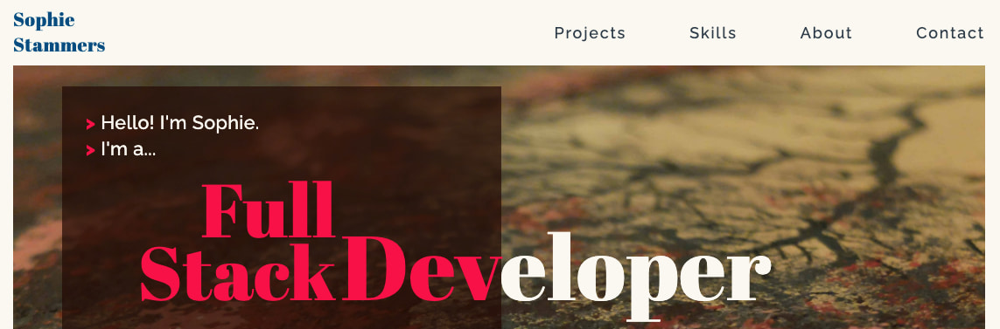
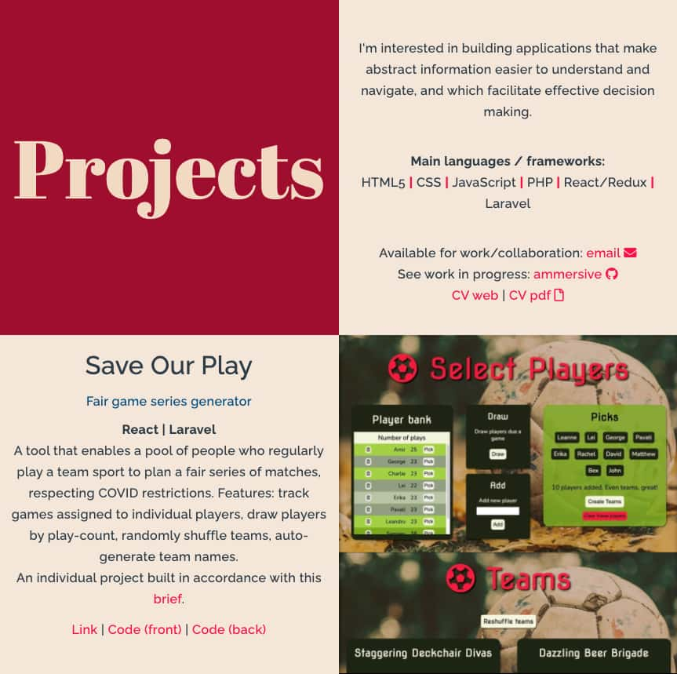
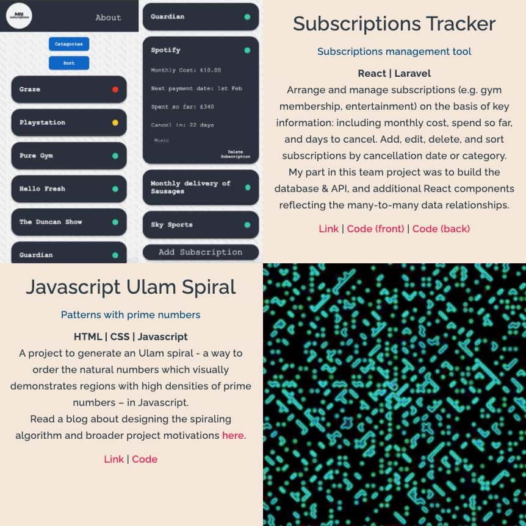
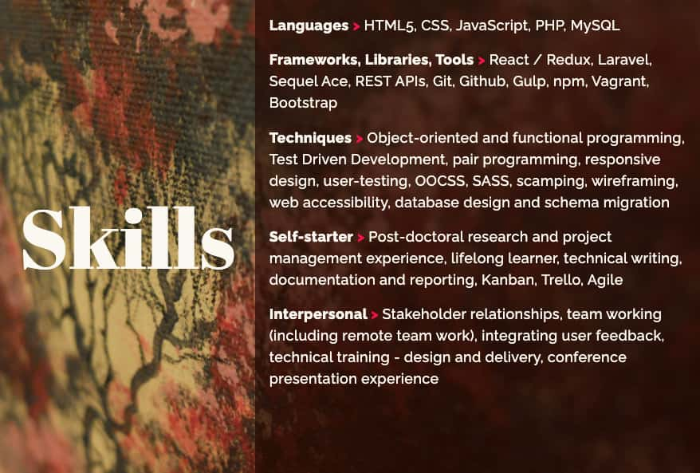

  

# Development portfolio site 

Hi, I'm Sophie, I'm a full stack developer. This is the repository of my portfolio website. 

It includes links to my deployed projects, CV and contact details, an overview of my skills, and a summary of my background.

### See the site itself [here](https://ammersive.github.io/portfolio/).

# Details

The site is built using HTML5 and CSS, in line with responsive design and web accessibility principles. The main page (index.html) contains:

- navigation bar with links to:
- hero section with terminal styling and headline
- projects section with short descriptions and links/repos
- skills section
- about section
- contact 

A web CV page (assets/cv.html) is linked from the contact section, where a pdf version is also available. All CSS styling can be found in the styles/ directory, whilst images and the cv pdf can be found in assets/ .

## About Sophie

I love solving problems and building solutions with efficient, scalable, maintainable code. 

With a background in academic research (philosophy and cognitive science), I'm a lifelong learner. I bring the experience of systematic thinking across a variety of problem domains, and the ability to communicate complex concepts to my web development work. 

I'm interested in building applications that make abstract information easier to understand and navigate, and which facilitate effective decision making.

## Main languages / frameworks:
### JavaScript | PHP | React/Redux | Laravel | HTML5 | CSS 

I'm currently available for work/collaboration: send me an [email](mailto:sophie.stammers@gmail.com).

  